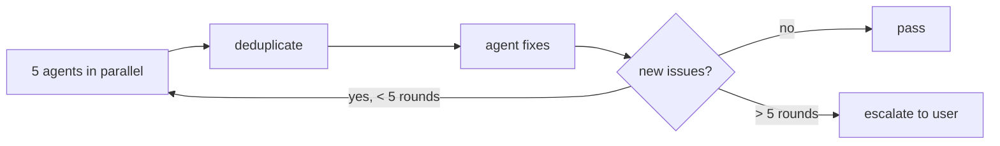
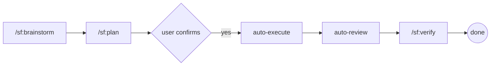

# StoreForge

[](https://opensource.org/licenses/MIT)
[](.claude-plugin/plugin.json)
[](https://docs.anthropic.com/en/docs/claude-code/overview)

> [简体中文](README.md) | [English](README-EN.md)

**Claude Code plugin for e-commerce development**, with hard-constraint Harness Engineering that ensures AI agents always follow correct technical paths.

## Core Philosophy

> **Constraints are not suggestions. They are rules.**

Most AI coding assistants give you "suggestions" and "best practices" — the agent can choose to ignore them. StoreForge is different: violating a rule **immediately blocks the current work** until it is fixed.

This ensures the technical path of your e-commerce project is always correct, even when the AI "wants" to take shortcuts.

## Why StoreForge

E-commerce projects have non-negotiable rules: amounts must never use floats, order states cannot jump arbitrarily, payment callbacks must be verified, inventory deduction must be race-free. AI coding assistants know these rules, but **have no mechanism to enforce them**.

StoreForge turns e-commerce best practices into **unbypassable hard constraints** through its Harness Engineering system, ensuring:

- Amounts are always `int64` (cents), never losing precision
- Order state transitions always go through a legal state machine path
- Payment callbacks always have complete signature verification, idempotency, and replay protection
- Inventory deduction always uses Redis Lua atomic operations + PostgreSQL transaction dual-write
- All write operations are always idempotent
- All list APIs are always paginated

## Tech Stack Coverage

| Domain | Stack | Anti-Patterns | Description |
| --- | --- | --- | --- |
| **Backend** | Golang + go-zero + GORM + PostgreSQL + Redis | 17 rules | Microservices, protobuf RPC |
| **Admin Panel** | Vue 3 + Element Plus + TypeScript + Pinia | 8 rules | Operations dashboard, SKU management |
| **Website** | Next.js App Router + shadcn/ui + next-intl | 9 rules | SSR + ISR, SEO optimized |
| **Mobile** | Flutter + Riverpod + go_router + Dio | 12 rules | 5 platforms (Android/iOS/WeChat/Alipay/Douyin mini-programs) |

## Four Core Mechanisms

### 1. Harness Engineering — Hard-Constraint System

Each technology domain defines an immutable anti-pattern checklist. After every code change, constraint checks trigger automatically:

| Level | Meaning | Action |
| --- | --- | --- |
| **BLOCK** | Violation = stop | Must fix immediately, re-check after fix |
| **WARN** | Suggested improvement | Logged to verification list, skippable with user confirmation |

For example, the backend has 17 BLOCK anti-patterns: handwritten handlers, raw SQL, HTTP for internal calls, float for amounts, unpaginated lists, non-idempotent writes, missing audit logs, direct SQL inventory deduction, arbitrary order state jumps... any violation blocks immediately.

### 2. Multi-Agent Self-Loop Review

After every code change, 5 specialized review sub-agents run in parallel:



| Sub-Agent | Focus Area |
| --- | --- |
| **storeforge-architect** | State machine closure, idempotency, anti-oversell, Saga orchestration, module boundaries |
| **storeforge-security-auditor** | Payment signature verification, PII encryption, amount precision, SQL injection, JWT security, rate limiting |
| **storeforge-performance-reviewer** | N+1 queries, Redis caching, CDN, pagination, connection pools |
| **storeforge-api-contract-checker** | Frontend-backend field alignment, enum consistency, unified error codes, amount conversion |
| **storeforge-testing-validator** | Unit test coverage, integration test paths, exception scenarios, test anti-patterns |

### 3. Three-Layer Testing

| Layer | Content | Coverage Requirement |
| --- | --- | --- |
| **L1 Unit Tests** | Core logic per domain | Go >= 80% (with race detector), Vue3 >= 70%, Next.js >= 80%, Flutter >= 70% |
| **L2 Integration** | 13 mandatory API scenarios (login → browse → cart → order → pay, concurrent oversell, idempotent callbacks, exclusive coupons) | Endpoint coverage >= 95% |
| **L3 E2E** | Next.js website golden path (browse → search → detail → SSR) | Golden path 100% pass |

### 4. User Decision Flow

- **Technical questions**: framework selection, code style, database design → decision trees built-in, no user interruption
- **Product questions**: business rules, UI details, operational strategy → must ask user via `AskUserQuestion`

## Quick Start

### Prerequisites

- [Claude Code](https://docs.anthropic.com/en/docs/claude-code/overview) installed
- git installed

### Installation

```bash
# Clone the repository
git clone https://github.com/PineappleBond/storeforge.git

# Install as a Claude Code plugin
# Method 1: via .claude/plugins directory
mkdir -p ~/.claude/plugins
ln -s /path/to/storeforge ~/.claude/plugins/storeforge

# Method 2: via Claude Code plugin management
/plugin install /path/to/storeforge
```

After installation, P0 rules are automatically injected at every session start.

### Usage

```text
/sf:brainstorm    # Start e-commerce project brainstorming
/sf:plan          # Convert requirements to implementation plan
/sf:review        # Multi-agent code review
/sf:test          # Execute three-layer testing
/sf:verify        # Final pre-completion verification
```

### Recommended Workflow



## Architecture

```text
storeforge/
├── .claude-plugin/
│   └── plugin.json              # Plugin metadata
├── CLAUDE.md                    # Project overview
├── README.md                    # 中文文档
├── README-EN.md                 # English documentation
├── skills/                      # 13 skills
│   ├── storeforge-using/        # Entry point (SessionStart injection)
│   ├── storeforge-brainstorm/   # E-commerce project brainstorming
│   ├── storeforge-writing-plans/# Implementation plan generation
│   ├── storeforge-executing/    # Plan execution engine
│   ├── storeforge-verification/ # Pre-completion validation
│   ├── storeforge-review/       # Multi-agent code review
│   ├── storeforge-testing/      # Three-layer testing system
│   ├── storeforge-domain-backend/  # Golang + go-zero hard constraints
│   ├── storeforge-domain-admin/    # Vue 3 + Element Plus hard constraints
│   ├── storeforge-domain-website/  # Next.js + shadcn/ui hard constraints
│   ├── storeforge-domain-flutter/  # Flutter multi-platform hard constraints
│   ├── storeforge-harness/      # Harness constraint engine
│   └── storeforge-user-decision/# User decision flow
├── agents/                      # 5 review sub-agents
│   ├── storeforge-architect.md
│   ├── storeforge-security-auditor.md
│   ├── storeforge-performance-reviewer.md
│   ├── storeforge-api-contract-checker.md
│   └── storeforge-testing-validator.md
├── hooks/
│   ├── hooks.json               # Hook registration
│   └── session-start            # Layered injection: P0 rules + P1 index
├── commands/                    # 5 shortcut commands
│   ├── sf-brainstorm.md
│   ├── sf-plan.md
│   ├── sf-review.md
│   ├── sf-test.md
│   └── sf-verify.md
└── knowledge/ecommerce-patterns/  # 19 e-commerce pattern files
    ├── auth-patterns.md           # JWT RS256 + refresh token
    ├── payment-patterns.md        # WeChat Pay / Alipay / Douyin Pay
    ├── cart-patterns.md           # Redis + PG dual-write cart
    ├── inventory-patterns.md      # Redis Lua inventory deduction
    ├── order-state-machine.md     # Complete order state transition
    ├── promotion-patterns.md      # Coupons / discounts / exclusive rules
    ├── search-patterns.md         # PG full-text / Elasticsearch
    ├── shipping-patterns.md       # Logistics + shipping cost
    ├── flash-sale-pattern.md      # Flash sale architecture
    ├── image-cdn-pattern.md       # CDN strategy + SSRF protection
    ├── error-codes-registry.md    # Unified error codes
    └── ... (19 files total)
```

## Hard-Constraint Quick Reference

### Backend (17 BLOCK rules)

- No handwritten handlers → must generate via `.api` + `goctl`
- No raw SQL / N+1 queries → must use GORM + Preload
- No HTTP for internal services → must use protobuf RPC
- No float for amounts → must use int64 (cents) + ROUND_HALF_UP
- No unpaginated lists → page/pageSize, max=100
- No non-idempotent writes → X-Idempotency-Key, Redis TTL=24h
- No direct SQL inventory deduction → Redis Lua + PG transaction + consistency compensation
- No arbitrary order state jumps → must use state machine
- No plaintext PII storage → AES-256-GCM encryption
- No returning GORM models from APIs → must use Response DTO
- ...17 rules total

### Admin Panel (8 BLOCK rules)

- Must use Element Plus, no other UI libraries
- Tables must support sorting/filtering/pagination/column resizing
- Forms must support dynamic validation/draft saving/reset
- Large file exports must be async tasks
- ...8 rules total

### Website (9 BLOCK rules)

- Must use App Router, no Pages Router
- Must use next-intl, no manual text replacement
- Must use shadcn/ui, no other UI libraries
- Product lists must be SSR + ISR
- Clients must never call backend APIs directly → must go through route handler proxy
- ...9 rules total

### Mobile (12 BLOCK rules)

- Must use Riverpod, no Provider/Bloc/GetX
- Must use go_router, no Navigator.push
- Must use freezed + json_serializable, no handwritten JSON parsing
- Must use Dio + interceptors, no http package direct calls
- Payments must use conditional compilation for all 5 platforms
- ...12 rules total

## Development

### Contributing

- Commit format: Conventional Commits, English description

  ```text
  feat(skill): add storeforge-domain-backend
  fix(domain): prevent float usage for amount
  docs: update plugin directory structure
  ```

- All skills use `storeforge-*` prefix
- All commands use `sf-` prefix
- No generic names (e.g., `brainstorming`, `testing`) to avoid conflicts with superpowers
- Update `plugin.json` and documentation after adding new skills

### Validate Plugin

```bash
# Verify JSON format
python -m json.tool .claude-plugin/plugin.json
python -m json.tool hooks/hooks.json
```

## License

[MIT](LICENSE)
