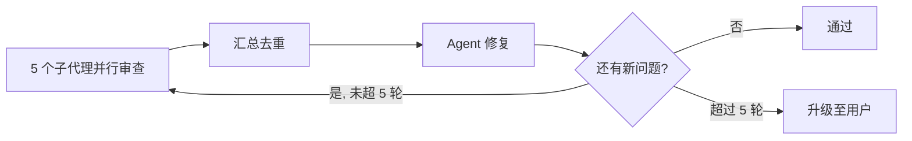
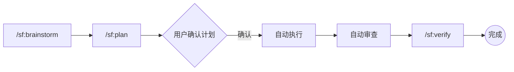

# StoreForge

[](https://opensource.org/licenses/MIT)
[](.claude-plugin/plugin.json)
[](https://docs.anthropic.com/en/docs/claude-code/overview)

> [English](README-EN.md) | [简体中文](README.md)

**Claude Code 电商开发插件**，内置大厂电商开发经验，通过 Harness Engineering 硬约束机制约束 Agent 走正确的技术路径。

## 核心理念

> **约束不是建议，是规则。**

大多数 AI 编程助手给你"建议"和"最佳实践"——Agent 可以选择忽略。StoreForge 不同：违反规则 = **立即阻断当前工作**，修复后才能继续。

这确保了电商项目的技术路径始终正确，即使 AI "想"走捷径也不行。

## 为什么需要 StoreForge

电商项目有明确的硬规则：金额不能用 float、订单状态不能随意跳转、支付回调必须验签、库存扣减必须防超卖。AI 编程助手知道这些规则，但**没有机制强制遵守**。

StoreForge 通过 Harness Engineering 系统，将电商最佳实践转化为**不可绕过的硬约束**，确保：

- 金额永远是 `int64`（分），永远不会有精度丢失
- 订单状态转换永远经过合法状态机路径
- 支付回调永远有完整的验签、幂等、防重放
- 库存扣减永远是 Redis Lua 原子操作 + PostgreSQL 事务双写
- 所有写操作永远幂等
- 所有列表接口永远分页

## 技术栈覆盖

| 端 | 技术栈 | 反模式数 | 说明 |
| --- | --- | --- | --- |
| **后端** | Golang + go-zero + GORM + PostgreSQL + Redis | 17 条 | 微服务架构，protobuf RPC 通信 |
| **管理后台** | Vue 3 + Element Plus + TypeScript + Pinia | 8 条 | 运营后台，SKU 维度管理 |
| **官网** | Next.js App Router + shadcn/ui + next-intl | 9 条 | SSR + ISR，SEO 优化 |
| **移动端** | Flutter + Riverpod + go_router + Dio | 12 条 | 5 端覆盖（Android/iOS/微信/支付宝/抖音小程序） |

## 四大核心机制

### 1. Harness Engineering — 硬约束系统

每个技术域定义不可变的反模式清单，开发完成后自动触发约束检查：

| 级别 | 语义 | 处理方式 |
|------|------|---------|
| **BLOCK** | 违反即停止 | 立即修复，修复后重新检查 |
| **WARN** | 建议性改进 | 记录到验证清单，用户确认后可跳过 |

例如后端 17 条 BLOCK 反模式：手写 handler、raw SQL、HTTP 调用内部服务、float 存金额、接口不分页、写操作不幂等、敏感操作无 audit log、直接 SQL 扣库存、订单状态随意跳转……任何一条违反都会立即阻断。

### 2. 多代理自循环 Review

每次代码变更后，并行启动 5 个专业审查子代理：



| 子代理 | 检查重点 |
|--------|---------|
| **storeforge-architect** | 状态机闭环、幂等设计、防超卖、Saga 编排、模块边界 |
| **storeforge-security-auditor** | 支付验签、PII 加密、金额精度、SQL 注入、JWT 安全、Rate Limit |
| **storeforge-performance-reviewer** | N+1 查询、Redis 缓存、CDN、分页、连接池 |
| **storeforge-api-contract-checker** | 前后端字段对齐、枚举一致、错误码统一、金额转换 |
| **storeforge-testing-validator** | 单元测试覆盖率、集成测试路径、异常场景、测试反模式 |

### 3. 三层测试体系

| 层级 | 内容 | 覆盖率要求 |
|------|------|-----------|
| **L1 单元测试** | 各端核心逻辑 | Go >= 80%（含 race detector），Vue3 >= 70%，Next.js >= 80%，Flutter >= 70% |
| **L2 集成测试** | 13 个必测 API 场景（登录→下单→支付、并发超卖、幂等回调、互斥优惠券等） | Endpoint 覆盖率 >= 95% |
| **L3 E2E 测试** | Next.js 官网黄金路径（浏览→搜索→详情→SSR） | 黄金路径 100% 通过 |

### 4. 用户决策流

- **技术问题**：框架选型、代码风格、数据库设计 → 决策树已内置，不骚扰用户
- **产品问题**：业务规则、UI 细节、运营策略 → 必须通过 `AskUserQuestion` 询问用户

## 快速开始

### 前提条件

- [Claude Code](https://docs.anthropic.com/en/docs/claude-code/overview) 已安装
- git 已安装

### 安装

通过 Claude Code 插件市场安装（推荐）：

```bash
# 添加 marketplace（只需执行一次）
claude plugin marketplace add https://github.com/PineappleBond/storeforge.git

# 安装插件
claude plugin install storeforge
```

> 插件默认安装到 `main` 分支。如需体验开发中的最新功能，可在安装后切换到 `dev` 分支：
>
> ```bash
> cd ~/.claude/plugins/cache/storeforge/storeforge/0.1.0
> git checkout dev
> ```

安装后，P0 规则会在每次会话启动时自动注入。

### 使用

```text
/sf:brainstorm    # 开始电商项目脑暴
/sf:plan          # 将需求转化为实施计划
/sf:review        # 多代理代码审查
/sf:test          # 执行三层测试
/sf:verify        # 完成前最终验证
```

### 推荐工作流



## 架构总览

```text
storeforge/
├── .claude-plugin/
│   └── plugin.json              # 插件元数据
├── CLAUDE.md                    # 项目总览
├── README.md                    # 中文文档
├── README-EN.md                 # English documentation
├── skills/                      # 13 个技能
│   ├── storeforge-using/        # 入口技能（SessionStart 注入）
│   ├── storeforge-brainstorm/   # 电商项目脑暴
│   ├── storeforge-writing-plans/# 实施计划生成
│   ├── storeforge-executing/    # 计划执行引擎
│   ├── storeforge-verification/ # 完成前验证
│   ├── storeforge-review/       # 多代理代码审查
│   ├── storeforge-testing/      # 三层测试体系
│   ├── storeforge-domain-backend/  # Golang + go-zero 硬约束
│   ├── storeforge-domain-admin/    # Vue 3 + Element Plus 硬约束
│   ├── storeforge-domain-website/  # Next.js + shadcn/ui 硬约束
│   ├── storeforge-domain-flutter/  # Flutter 多端硬约束
│   ├── storeforge-harness/      # Harness 约束引擎
│   └── storeforge-user-decision/# 用户决策流程
├── agents/                      # 5 个审查子代理
│   ├── storeforge-architect.md
│   ├── storeforge-security-auditor.md
│   ├── storeforge-performance-reviewer.md
│   ├── storeforge-api-contract-checker.md
│   └── storeforge-testing-validator.md
├── hooks/
│   ├── hooks.json               # Hook 注册
│   └── session-start            # 分层注入：P0 规则 + P1 索引
├── commands/                    # 5 个快捷命令
│   ├── sf-brainstorm.md
│   ├── sf-plan.md
│   ├── sf-review.md
│   ├── sf-test.md
│   └── sf-verify.md
└── knowledge/ecommerce-patterns/  # 19 个电商模式文件
    ├── auth-patterns.md           # JWT RS256 + refresh token
    ├── payment-patterns.md        # 微信/支付宝/抖音支付
    ├── cart-patterns.md           # Redis + PG 双写购物车
    ├── inventory-patterns.md      # Redis Lua 库存扣减
    ├── order-state-machine.md     # 完整订单状态转换图
    ├── promotion-patterns.md      # 优惠券/满减/互斥规则
    ├── search-patterns.md         # PG 全文搜索 / Elasticsearch
    ├── shipping-patterns.md       # 物流接入 + 运费计算
    ├── flash-sale-pattern.md      # 秒杀架构
    ├── image-cdn-pattern.md       # CDN 策略 + 防 SSRF
    ├── error-codes-registry.md    # 统一错误码
    └── ... 等共 19 个模式文件
```

## 电商硬约束速查

### 后端（17 条 BLOCK）

- 禁止手写 handler → 必须 `.api` + `goctl` 生成
- 禁止 raw SQL / N+1 查询 → 必须 GORM + Preload
- 禁止 HTTP 调用内部服务 → 必须 protobuf RPC
- 禁止 float 存金额 → 必须 int64（分）+ ROUND_HALF_UP
- 禁止接口不分页 → page/pageSize, max=100
- 禁止写操作不幂等 → X-Idempotency-Key, Redis TTL=24h
- 禁止库存直接扣减 → Redis Lua + PG 事务 + 一致性补偿
- 禁止订单状态随意跳转 → 必须状态机
- 禁止 PII 明文存储 → AES-256-GCM 加密
- 禁止 API 返回 GORM model → 必须 Response DTO
- ……共 17 条

### 管理后台（8 条 BLOCK）

- 必须 Element Plus，禁止其他 UI 库
- 表格必须支持排序/筛选/分页/列宽拖拽
- 表单必须支持动态校验/草稿保存/重置
- 大文件导出必须异步任务
- ……共 8 条

### 官网（9 条 BLOCK）

- 必须 App Router，禁止 Pages Router
- 必须 next-intl，禁止手动替换文案
- 必须 shadcn/ui，禁止其他 UI 库
- 商品列表必须 SSR + ISR
- 客户端禁止直连后端 API → 必须 route handler 代理
- ……共 9 条

### 移动端（12 条 BLOCK）

- 必须 Riverpod，禁止 Provider/Bloc/GetX
- 必须 go_router，禁止 Navigator.push
- 必须 freezed + json_serializable，禁止手写 JSON
- 必须 Dio + interceptor，禁止 http 包直调
- 支付必须条件编译区分 5 端
- ……共 12 条

## 开发

### 贡献指南

- Commit 格式：Conventional Commits，英文描述

  ```text
  feat(skill): add storeforge-domain-backend
  fix(domain): prevent float usage for amount
  docs: update plugin directory structure
  ```

- 所有 skill 使用 `storeforge-*` 前缀
- 所有 command 使用 `sf-` 前缀
- 禁止使用通用名称（如 `brainstorming`、`testing`）避免与 superpowers 冲突
- 新增 skill 后更新 `plugin.json` 和本文档

### 验证插件

```bash
# 验证 JSON 格式
python -m json.tool .claude-plugin/plugin.json
python -m json.tool hooks/hooks.json
```

## License

[MIT](LICENSE)
