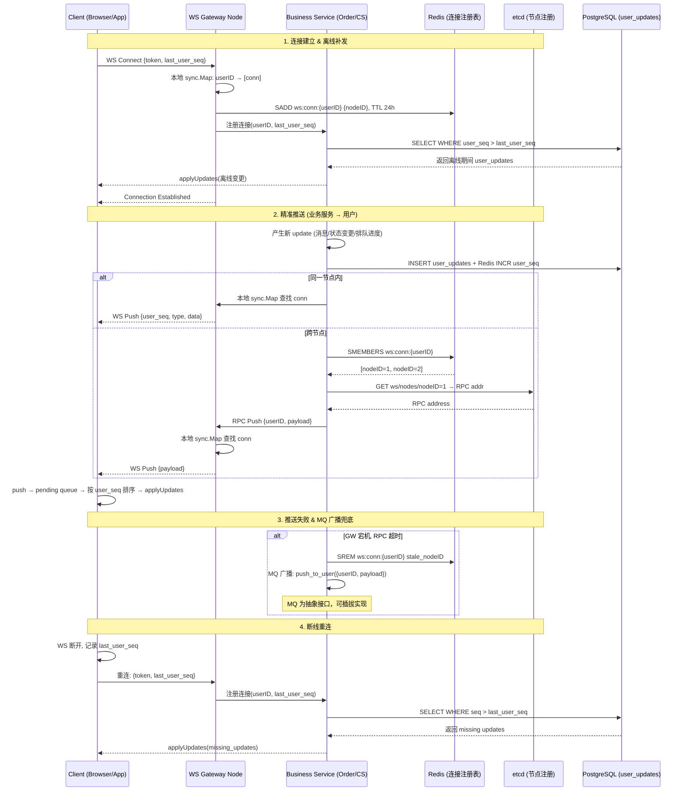
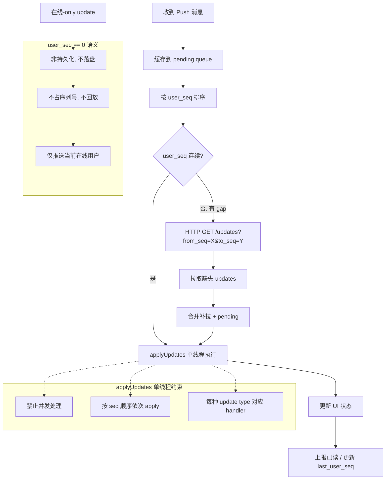
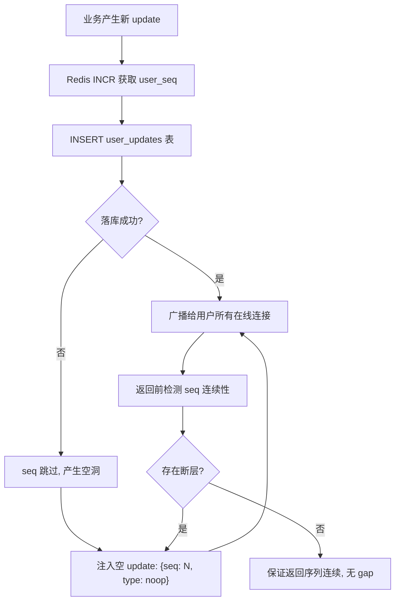

# 客服系统 (Customer Service System)

## 触发条件

- 需要在线客服、工单系统、AI 智能客服、会话分配、满意度评价
- 需要支持 WebSocket 长连接实时通信
- 需要多渠道接入（Web/H5/小程序/APP）
- 需要会话队列管理（VIP 优先、排队反馈）
- 需要历史消息搜索和工单升级流转

## 推荐第三方库

| 用途 | 推荐库 | 导入路径 |
|------|--------|----------|
| WebSocket 长连接 | gorilla/websocket | `github.com/gorilla/websocket` |
| 消息队列（会话分发） | RabbitMQ / NATS | `github.com/rabbitmq/amqp091-go` / `github.com/nats-io/nats.go` |
| 会话存储 | redis | `github.com/redis/go-redis/v9` |
| 全文搜索（历史消息） | bleve | `github.com/blevesearch/bleve/v2` (纯 Go 搜索引擎) |
| AI 客服 | eino | `github.com/cloudwego/eino` |

## 决策树

```
用户发起咨询
  │
  ├─ AI 机器人优先接待
  │   ├─ AI 能回答 → 直接回复 → 用户满意？ → 结束会话 → 满意度评价
  │   └─ AI 无法回答 / 用户要求人工 → 转人工
  │
  ├─ 转人工 → 会话进入队列
  │   ├─ VIP 用户 → 高优先级队列（优先分配）
  │   ├─ 普通用户 → 普通队列（按等待时间排序）
  │   └─ 队列满？ → 引导留言或创建工单
  │
  ├─ 坐席分配（轮询 + 技能匹配）
  │   ├─ 商品咨询 → 商品技能组
  │   ├─ 退款/退货 → 售后技能组
  │   ├─ 物流问题 → 物流技能组
  │   └─ 投诉 → 投诉处理组
  │
  ├─ 坐席状态检查
  │   ├─ 在线 & 空闲 → 立即分配
  │   ├─ 在线 & 忙碌 → 排队等待
  │   └─ 离线 → 跳过该坐席，尝试下一个
  │
  ├─ 会话进行中
  │   ├─ 问题解决 → 坐席结束会话 → 满意度评价
  │   ├─ 需要升级 → 转工单系统 → 工单流转
  │   └─ 用户长时间未回复 → 超时提醒 → 自动关闭
  │
  └─ 会话结束后
      ├─ 满意度评价（1-5 星）
      ├─ 低分（1-2 星）→ 自动触发回访工单
      └─ 生成会话记录和统计报表
```

## 代码模板

### 0. 配置与工具函数

```go
package customerservice

import (
	"crypto/rand"
	"encoding/hex"
	"os"
	"strings"

	"github.com/zeromicro/go-zero/core/logx"
)

// Config 客服系统配置
type Config struct {
	TenantID               string
	NodeID                 string
	MaxConns               int
	OriginWhitelist        []string // 允许的 Origin 列表
	HeartbeatIntervalSec   int
	HeartbeatTimeoutSec    int
	MaxMessageLength       int  // 单条消息最大长度
	DefaultAgentMaxSessions int // 坐席默认最大并发数，0 时使用默认值 5
}

// getNodeID 获取当前节点 ID
func getNodeID() string {
	id := os.Getenv("NODE_ID")
	if id == "" {
		// fallback: 使用 hostname
		hostname, err := os.Hostname()
		if err != nil {
			logx.Errorf("get hostname for nodeID: %v", err)
			return "unknown"
		}
		return hostname
	}
	return id
}

// generateTicketID 生成工单 ID（ULID 风格，避免高并发冲突）
func generateTicketID() string {
	b := make([]byte, 16)
	if _, err := rand.Read(b); err != nil {
		logx.Errorf("generate random bytes for ticketID: %v", err)
		return ""
	}
	return "TKT" + hex.EncodeToString(b)[:16]
}

// IsAllowedOrigin 校验 WebSocket 升级请求的 Origin
func IsAllowedOrigin(origin string, whitelist []string) bool {
	if len(whitelist) == 0 {
		return false
	}
	for _, allowed := range whitelist {
		if origin == allowed {
			return true
		}
	}
	return false
}

// SanitizeMessage 清理消息内容（基础 XSS 防护）
func SanitizeMessage(content string) string {
	content = strings.ReplaceAll(content, "<", "&lt;")
	content = strings.ReplaceAll(content, ">", "&gt;")
	content = strings.ReplaceAll(content, "\"", "&quot;")
	return strings.TrimSpace(content)
}

// makeTenantKey 生成带 tenantID 前缀的 Redis key
func makeTenantKey(tenantID, key string) string {
	return tenantID + ":" + key
}

// resolveAgentMaxSessions 返回坐席最大并发数，0 时取默认值 5
func resolveAgentMaxSessions(cfgValue int) int {
	if cfgValue > 0 {
		return cfgValue
	}
	return 5
}
```

### 1. 会话模型（ChatSession）

```go
package customerservice

import "time"

// SessionStatus 会话状态
type SessionStatus int

const (
	SessionWaiting   SessionStatus = 1 // 排队等待中
	SessionActive    SessionStatus = 2 // 会话进行中
	SessionClosed    SessionStatus = 3 // 已关闭
	SessionTransferred SessionStatus = 4 // 已转工单
	SessionTimeout   SessionStatus = 5 // 超时关闭
)

func (s SessionStatus) String() string {
	m := map[SessionStatus]string{
		SessionWaiting:     "waiting",
		SessionActive:      "active",
		SessionClosed:      "closed",
		SessionTransferred: "transferred",
		SessionTimeout:     "timeout",
	}
	if name, ok := m[s]; ok {
		return name
	}
	return "unknown"
}

// ChatSession 会话模型
type ChatSession struct {
	ID            string        `gorm:"primaryKey;type:varchar(64)"`
	TenantID      string        `gorm:"type:varchar(64);not null;index:idx_tenant"`
	UserID        string        `gorm:"type:varchar(64);not null;index:idx_tenant_user"`
	AgentID       string        `gorm:"type:varchar(64);index"`
	AgentGroup    string        `gorm:"type:varchar(32)"` // 技能组：product/refund/logistics/complaint
	Status        SessionStatus `gorm:"not null;default:1;index"`
	VIPLevel      int           `gorm:"not null;default:0"` // VIP 等级，数值越大优先级越高
	Source        string        `gorm:"type:varchar(32)"`   // web/h5/miniprogram/app
	QueuePosition int           `gorm:"default:0"`          // 排队位置（仅 waiting 状态有效）
	WaitSeconds   int           `gorm:"default:0"`          // 已等待秒数
	CreatedAt     time.Time     `gorm:"not null;autoCreateTime"`
	UpdatedAt     time.Time     `gorm:"not null;autoUpdateTime"`
	AssignedAt    *time.Time    `gorm:"null"` // 分配坐席时间
	ClosedAt      *time.Time    `gorm:"null"` // 关闭时间
}

func (ChatSession) TableName() string {
	return "chat_sessions"
}
```

### 2b. 用户更新模型 (UserUpdate — 写扩散)

> 采用类 Telegram update 模式，所有状态变更通过 user_seq 序列推送给用户。

```go
package customerservice

import "time"

// UpdateType 更新类型
type UpdateType string

const (
	UpdateChatMessage   UpdateType = "chat_msg"      // 新对话消息
	UpdateReadReceipt   UpdateType = "read_receipt"  // 已读回执
	UpdateSessionStatus UpdateType = "session_status" // 会话状态变更
	UpdateQueuePosition UpdateType = "queue_pos"     // 排队位置更新
	UpdateSystemNotice  UpdateType = "system"        // 系统通知
	UpdateNoop          UpdateType = "noop"          // 空 update，仅用于 gap 补全
)

// UserUpdate 用户级更新（写扩散到 user_updates 表）
type UserUpdate struct {
	ID         int64      `gorm:"primaryKey;autoIncrement"`
	TenantID   string     `gorm:"type:varchar(64);not null;index:idx_tenant"`
	UserID     string     `gorm:"type:varchar(64);not null;index:idx_tenant_user_seq"`
	UserSeq    int64      `gorm:"not null;index:idx_tenant_user_seq"` // 用户级序列号，单调递增，Redis INCR 获取
	UpdateType UpdateType `gorm:"type:varchar(32);not null"`
	SessionID  string     `gorm:"type:varchar(64)"` // 关联的会话（可选）
	Data       string     `gorm:"type:text;not null"` // JSON 序列化的更新内容
	CreatedAt  time.Time  `gorm:"not null;autoCreateTime"`
}

func (UserUpdate) TableName() string {
	return "user_updates"
}

// NewOnlineUpdate 创建在线-only update（seq == 0，不落盘，不回放）
func NewOnlineUpdate(updateType UpdateType, sessionID string, data string) UserUpdate {
    return UserUpdate{
        UserSeq:    0, // seq == 0: 非持久化，仅推送当前在线用户
        UpdateType: updateType,
        SessionID:  sessionID,
        Data:       data,
    }
}
```

### 2. 消息模型（ChatMessage）

```go
package customerservice

import "time"

// SenderType 发送者类型
type SenderType string

const (
	SenderUser   SenderType = "user"
	SenderAgent  SenderType = "agent"
	SenderSystem SenderType = "system"
	SenderBot    SenderType = "bot"
)

// ContentType 内容类型
type ContentType string

const (
	ContentTypeText  ContentType = "text"
	ContentTypeImage ContentType = "image"
	ContentTypeFile  ContentType = "file"
	ContentTypeCard  ContentType = "card" // 卡片消息（快捷操作/商品推荐）
)

// ChatMessage 消息模型
type ChatMessage struct {
	ID          int64       `gorm:"primaryKey;autoIncrement"`
	TenantID    string      `gorm:"type:varchar(64);not null;index:idx_tenant"`
	SessionID   string      `gorm:"type:varchar(64);not null;index:idx_session_conv_seq"`
	ConvSeq     int64       `gorm:"not null;index:idx_session_conv_seq"` // 对话内序列号，单调递增，仅用于对话内排序 & 已读
	SenderType  SenderType  `gorm:"type:varchar(16);not null"`
	SenderID    string      `gorm:"type:varchar(64)"` // 用户ID/坐席ID/bot
	Content     string      `gorm:"type:text;not null"`
	ContentType ContentType `gorm:"type:varchar(16);not null;default:text"`
	FileURL     string      `gorm:"type:varchar(512)"`   // 文件/图片 URL
	MimeType    string      `gorm:"type:varchar(64)"`    // 文件 MIME 类型
	FileSize    int64       `gorm:"default:0"`           // 文件大小（字节）
	IsRead      bool        `gorm:"not null;default:false"`
	CreatedAt   time.Time   `gorm:"not null;autoCreateTime;index"`
}

func (ChatMessage) TableName() string {
	return "chat_messages"
}
```

### 3. WebSocket 处理器（基于 go-zero）

```go
package customerservice

import (
	"context"
	"encoding/json"
	"fmt"
	"net/http"
	"sync"
	"time"

	"github.com/gorilla/websocket"
	"github.com/redis/go-redis/v9"
	"github.com/zeromicro/go-zero/core/logx"
)

// WSMessageType WebSocket 消息类型
type WSMessageType string

const (
	WsMsgChat      WSMessageType = "chat"       // 聊天消息
	WsMsgHeartbeat WSMessageType = "heartbeat"  // 心跳
	WsMsgPong      WSMessageType = "pong"       // 心跳回应
	WsMsgSystem    WSMessageType = "system"     // 系统通知（排队进度、分配成功等）
)

// WSMessage WebSocket 消息结构
type WSMessage struct {
	Type      WSMessageType `json:"type"`
	SessionID string        `json:"session_id"`
	Content   string        `json:"content"`
	Timestamp int64         `json:"timestamp"`
	Extra     map[string]any `json:"extra,omitempty"`
}

// WSConnection 封装 WebSocket 连接和关联信息
type WSConnection struct {
	Conn      *websocket.Conn
	UserID    string
	SessionID string
	LastPing  time.Time
	Mu        sync.Mutex
}

// Send 安全发送消息
func (wc *WSConnection) Send(ctx context.Context, msg WSMessage) error {
	wc.Mu.Lock()
	defer wc.Mu.Unlock()
	data, err := json.Marshal(msg)
	if err != nil {
		return fmt.Errorf("marshal ws message: %w", err)
	}
	return wc.Conn.WriteMessage(websocket.TextMessage, data)
}

// WSServer WebSocket 服务器
type WSServer struct {
    cfg          Config
    connections  sync.Map // userID -> *WSConnection
    rdb          *redis.Client
    resolver     PushTargetResolver
    upgrader     websocket.Upgrader
    currentConns int64
    mu           sync.Mutex
}

// NewWSServer 创建 WebSocket 服务器
func NewWSServer(cfg Config, rdb *redis.Client, resolver PushTargetResolver) *WSServer {
    return &WSServer{
        cfg: cfg,
        rdb: rdb,
        resolver: resolver,
        upgrader: websocket.Upgrader{
            ReadBufferSize:  4096,
            WriteBufferSize: 4096,
            CheckOrigin: func(r *http.Request) bool {
                return IsAllowedOrigin(r.Header.Get("Origin"), cfg.OriginWhitelist)
            },
        },
    }
}

// HandleUpgrade 处理 WebSocket 升级请求（go-zero Handler 中使用）
func (s *WSServer) HandleUpgrade(userID string, w http.ResponseWriter, r *http.Request) error {
	s.mu.Lock()
	if s.currentConns >= int64(s.cfg.MaxConns) {
		s.mu.Unlock()
		http.Error(w, "server is full", http.StatusServiceUnavailable)
		return fmt.Errorf("ws: max connections reached (%d)", s.cfg.MaxConns)
	}
	s.currentConns++
	s.mu.Unlock()

	conn, err := s.upgrader.Upgrade(w, r, nil)
	if err != nil {
		s.mu.Lock()
		s.currentConns--
		s.mu.Unlock()
		return fmt.Errorf("ws: upgrade failed: %w", err)
	}

	wsConn := &WSConnection{
		Conn:     conn,
		UserID:   userID,
		LastPing: time.Now(),
	}
	s.connections.Store(userID, wsConn)

	// 注册到 Redis（用于多节点发现），使用 SADD 支持多设备多节点
	ctx := r.Context()
	connKey := makeTenantKey(s.cfg.TenantID, fmt.Sprintf("ws:conn:%s", userID))
	s.rdb.SAdd(ctx, connKey, getNodeID())
	s.rdb.Expire(ctx, connKey, 24*time.Hour)

	go s.readLoop(ctx, wsConn)
	go s.heartbeatLoop(ctx, wsConn)

	return nil
}

// readLoop 读取客户端消息
func (s *WSServer) readLoop(ctx context.Context, wsConn *WSConnection) {
	defer func() {
		s.connections.Delete(wsConn.UserID)
		wsConn.Conn.Close()
		s.mu.Lock()
		s.currentConns--
		s.mu.Unlock()
		// 清理 Redis 连接记录（使用 withoutCancel 防止 request ctx 被 cancel 后清理失败）
		ctx := context.WithoutCancel(ctx)
		connKey := makeTenantKey(s.cfg.TenantID, fmt.Sprintf("ws:conn:%s", wsConn.UserID))
		s.rdb.SRem(ctx, connKey, getNodeID())
	}()

	for {
		_, data, err := wsConn.Conn.ReadMessage()
		if err != nil {
			if websocket.IsUnexpectedCloseError(err, websocket.CloseGoingAway, websocket.CloseNormalClosure) {
				logx.WithContext(ctx).Errorf("ws: unexpected close for user %s: %v", wsConn.UserID, err)
			}
			return
		}

		var msg WSMessage
		if err := json.Unmarshal(data, &msg); err != nil {
			logx.WithContext(ctx).Errorf("ws: invalid message from user %s: %v", wsConn.UserID, err)
			continue
		}

		// 输入校验
		if len(msg.Content) > s.cfg.MaxMessageLength {
			logx.WithContext(ctx).Errorf("ws: message too long from user %s: %d bytes", wsConn.UserID, len(msg.Content))
			continue
		}
		msg.Content = SanitizeMessage(msg.Content)

		// 消息去重：使用 Redis 检查是否已处理过相同消息
		dedupKey := makeTenantKey(s.cfg.TenantID, fmt.Sprintf("ws:dedup:%s:%s:%d", wsConn.UserID, msg.Content, msg.Timestamp))
		exists, err := s.rdb.SetNX(ctx, dedupKey, "1", 5*time.Minute).Result()
		if err != nil {
			logx.WithContext(ctx).Errorf("ws: dedup check failed for user %s: %v", wsConn.UserID, err)
			// 去重失败时降级：继续处理，允许少量重复
		} else if !exists {
			continue // 重复消息，跳过
		}

		s.handleMessage(ctx, wsConn, msg)
	}
}

// heartbeatLoop 心跳保活
func (s *WSServer) heartbeatLoop(ctx context.Context, wsConn *WSConnection) {
	interval := time.Duration(s.cfg.HeartbeatIntervalSec) * time.Second
	if interval == 0 {
		interval = 30 * time.Second
	}
	timeout := time.Duration(s.cfg.HeartbeatTimeoutSec) * time.Second
	if timeout == 0 {
		timeout = 90 * time.Second
	}

	ticker := time.NewTicker(interval)
	defer ticker.Stop()

	for {
		select {
		case <-ctx.Done():
			return
		case <-ticker.C:
			if time.Since(wsConn.LastPing) > timeout {
				logx.WithContext(ctx).Infof("ws: heartbeat timeout for user %s, closing connection", wsConn.UserID)
				wsConn.Conn.Close()
				return
			}

			msg := WSMessage{
				Type:      WsMsgHeartbeat,
				Timestamp: time.Now().UnixMilli(),
			}
			if err := wsConn.Send(ctx, msg); err != nil {
				logx.WithContext(ctx).Errorf("ws: heartbeat send failed for user %s: %v", wsConn.UserID, err)
				return
			}
		}
	}
}

// handleMessage 分发处理客户端消息
func (s *WSServer) handleMessage(ctx context.Context, wsConn *WSConnection, msg WSMessage) {
	switch msg.Type {
	case WsMsgChat:
		s.enqueueChatMessage(ctx, wsConn.UserID, wsConn.SessionID, msg.Content)
	case WsMsgPong:
		wsConn.LastPing = time.Now()
	case WsMsgSystem:
		// 系统消息一般不来自客户端，忽略
	}
}

// enqueueChatMessage 将消息投递到 MQ（Outbox 模式，完整实现见消息服务层）
func (s *WSServer) enqueueChatMessage(ctx context.Context, userID, sessionID, content string) {
	// 生产环境：通过 Outbox + MQ 异步路由到坐席/AI
	// 示例：使用 Redis Pub/Sub 作为轻量 MQ 后端
	payload, _ := json.Marshal(map[string]string{
		"user_id":    userID,
		"session_id": sessionID,
		"content":    content,
	})
	s.rdb.Publish(ctx, makeTenantKey(s.cfg.TenantID, "cs:msg:queue"), string(payload))
}

// SendMessageToUser 向指定用户推送消息（跨节点通过 Redis Pub/Sub）
func (s *WSServer) SendMessageToUser(ctx context.Context, userID string, msg WSMessage) error {
	val, ok := s.connections.Load(userID)
	if !ok {
		return s.broadcastViaRedis(ctx, userID, msg)
	}
	wsConn := val.(*WSConnection)
	return wsConn.Send(ctx, msg)
}

func (s *WSServer) broadcastViaRedis(ctx context.Context, userID string, msg WSMessage) error {
	data, err := json.Marshal(msg)
	if err != nil {
		return fmt.Errorf("marshal ws message for broadcast: %w", err)
	}
	channel := makeTenantKey(s.cfg.TenantID, fmt.Sprintf("ws:notify:%s", userID))
	return s.rdb.Publish(ctx, channel, string(data)).Err()
}
```

### 3b. 多节点精准推送架构

> 采用 etcd 节点注册发现 + Redis 连接注册表 + RPC 精准推送 + MQ 广播兜底模式（参考 review-principles P2#25）。

```go
package customerservice

import (
    "context"
    "encoding/json"
    "fmt"
    "sync"
    "time"

    "github.com/redis/go-redis/v9"
    "github.com/zeromicro/go-zero/core/logx"
)

// PushTargetResolver 精准推送解析器（多节点场景）
type PushTargetResolver interface {
    // ResolveNodeIDs 查询 userID 所在的所有 Gateway 节点
    ResolveNodeIDs(ctx context.Context, userID string) ([]string, error)
    // GetNodeRPCAddr 通过 etcd 获取节点的 RPC 地址
    GetNodeRPCAddr(ctx context.Context, nodeID string) (string, error)
    // PushViaRPC 通过 RPC 推送到指定 Gateway 节点
    PushViaRPC(ctx context.Context, nodeRPCAddr string, userID string, payload []byte) error
    // BroadcastFallback MQ 广播兜底（所有 Gateway 自行过滤）
    BroadcastFallback(ctx context.Context, userID string, payload []byte) error
    // ClearStaleRecord 推送失败时清除 Redis 脏记录
    ClearStaleRecord(ctx context.Context, userID string, nodeID string) error
}

// WSServer.PushUser 向指定用户推送（双层查找：本地 sync.Map → 多节点精准推送 → MQ 兜底）
func (s *WSServer) PushUser(ctx context.Context, userID string, update UserUpdate) error {
    // 1. 优先查本地 sync.Map（同一节点内）
    if val, ok := s.connections.Load(userID); ok {
        wsConn := val.(*WSConnection)
        return wsConn.Send(ctx, WSMessage{
            Type:      WSMessageType(update.UpdateType),
            SessionID: update.SessionID,
            Content:   update.Data,
            Timestamp: time.Now().UnixMilli(),
        })
    }

    // 2. 本地无连接 → 查 Redis 获取用户所在的所有 nodeIDs
    connKey := makeTenantKey(s.cfg.TenantID, fmt.Sprintf("ws:conn:%s", userID))
    nodeIDs, err := s.rdb.SMembers(ctx, connKey).Result()
    if err != nil {
        // Redis 查询失败 → 降级 MQ 广播
        return s.broadcastViaRedis(ctx, userID, WSMessage{
            Type:    WSMessageType(update.UpdateType),
            Content: update.Data,
        })
    }

    if len(nodeIDs) == 0 {
        // 无任何在线连接 → MQ 广播兜底
        return s.broadcastViaRedis(ctx, userID, WSMessage{
            Type:    WSMessageType(update.UpdateType),
            Content: update.Data,
        })
    }

    // 3. 逐节点 RPC 精准推送
    payload, _ := json.Marshal(WSMessage{
        Type:    WSMessageType(update.UpdateType),
        Content: update.Data,
    })

    var lastErr error
    for _, nodeID := range nodeIDs {
        if nodeID == s.cfg.NodeID {
            continue // 已在本地查过 sync.Map，跳过
        }
        rpcAddr, err := s.resolver.GetNodeRPCAddr(ctx, nodeID)
        if err != nil {
            lastErr = err
            continue
        }
        err = s.resolver.PushViaRPC(ctx, rpcAddr, userID, payload)
        if err != nil {
            logx.WithContext(ctx).Errorf("push: RPC to node %s failed: %v", nodeID, err)
            // 推送失败 → 清脏记录 + MQ 广播兜底
            s.resolver.ClearStaleRecord(ctx, userID, nodeID)
            lastErr = s.resolver.BroadcastFallback(ctx, userID, payload)
        }
    }
    return lastErr
}
```

**推送流程**：
1. 本地 `sync.Map` 查找 → 找到则直接 WS 推送
2. 本地无 → Redis `SMEMBERS ws:conn:{userID}` 获取 nodeIDs（Set 结构，支持多设备多节点）
3. 逐节点 `SADD ws:conn:{userID} {nodeID}` 注册，带 TTL
4. 通过 etcd `GET ws/nodes/{nodeID}` 解析 RPC 地址
5. RPC 推送到目标 Gateway → Gateway 本地 `sync.Map` 查找 conn → WS 推送
6. 推送失败 → 清 Redis 脏记录 → 降级 MQ 广播兜底

### 3c. applyUpdates 统一处理模式

> 所有状态变更（消息、已读、会话状态、排队进度）统一通过 `applyUpdates([]update)` 单线程处理，禁止并发。

**客户端处理流程**：
1. 收到 push → 缓存到 pending queue
2. 按 `user_seq` 排序，检测 gaps
3. `user_seq` 连续 → `applyUpdates(sorted_updates)` 单线程执行
4. 发现 gap → HTTP GET `/updates?from_seq=X&to_seq=Y` 补拉缺失区间
5. 合并补拉 + pending → `applyUpdates`

**服务端 Gap 补全**：
- `user_seq` 由 Redis INCR 获取，不保证落库成功，可能产生断层
- 返回前检测 `user_seq` 连续性
- 存在断层 → 注入空 update: `{seq: N, type: "noop"}`
- 保证返回的 update 序列连续，无 gap

**`user_seq == 0` 语义**：
- 非持久化 update，仅推送当前在线用户
- 不落盘、不回放、不占序列号
- 适用于心跳确认、临时提示等场景

```go
package customerservice

// UpdateService 统一更新服务
type UpdateService struct {
    cfg      Config
    db       *gorm.DB
    rdb      *redis.Client
    pusher   func(ctx context.Context, userID string, update UserUpdate) error
}

// ApplyUpdate 产生一个用户级更新（写扩散模式）
func (svc *UpdateService) ApplyUpdate(ctx context.Context, userID string, updateType UpdateType, sessionID string, data interface{}) error {
    jsonData, _ := json.Marshal(data)

    // seq == 0: 仅在线推送，不落盘
    if updateType == UpdateSystemNotice {
        if m, ok := data.(map[string]any); ok && m["online_only"] == true {
            onlineUpdate := NewOnlineUpdate(updateType, sessionID, string(jsonData))
            return svc.pusher(ctx, userID, onlineUpdate)
        }
    }

    // seq > 0: 持久化 update
    uSeq, err := svc.rdb.Incr(ctx, makeTenantKey(svc.cfg.TenantID, "cs:user_seq:"+userID)).Result()
    if err != nil {
        return fmt.Errorf("incr user_seq: %w", err)
    }

    u := UserUpdate{
        TenantID:   svc.cfg.TenantID,
        UserID:     userID,
        UserSeq:    uSeq,
        UpdateType: updateType,
        SessionID:  sessionID,
        Data:       string(jsonData),
    }

    // 写入 user_updates 表（与业务操作同事务）
    if err := svc.db.WithContext(ctx).Create(&u).Error; err != nil {
        // 落库失败 → seq 产生空洞，注入空 update 补全
        noop := UserUpdate{
            TenantID:   svc.cfg.TenantID,
            UserID:     userID,
            UserSeq:    uSeq,
            UpdateType: UpdateNoop,
            Data:       "{}",
        }
        if err2 := svc.db.WithContext(ctx).Create(&noop).Error; err2 != nil {
            logx.WithContext(ctx).Errorf("noop injection failed for seq %d: %v", uSeq, err2)
        }
        return fmt.Errorf("create user_update: %w", err)
    }

    // 推送给该用户所有在线连接
    return svc.pusher(ctx, userID, u)
}

// GetOfflineUpdates 获取离线期间的更新（补发）
func (svc *UpdateService) GetOfflineUpdates(ctx context.Context, tenantID, userID string, lastSeq int64) ([]UserUpdate, error) {
    var updates []UserUpdate
    err := svc.db.WithContext(ctx).
        Where("tenant_id = ? AND user_id = ? AND user_seq > ?", tenantID, userID, lastSeq).
        Order("user_seq ASC").
        Find(&updates).Error
    return updates, err
}
```

**事务要求**（参考 review-principles P2#22）：
新增对话消息时，以下三步必须在同一 DB 事务内完成：
1. `INSERT chat_messages`（消息记录）
2. 为消息关联的每个对话成员 `INSERT user_updates`（写扩散）
3. 保证原子性，避免 seq 断层或数据不一致

### 3d. 通讯流程总览

#### 多节点精准推送流程



#### Client applyUpdates 流程



#### 服务端 Gap 补全流程



### 4. 会话路由算法（轮询 + 技能匹配）

```go
package customerservice

import (
	"context"
	"fmt"
	"strings"
	"sync"
	"time"

	"github.com/redis/go-redis/v9"
	"github.com/zeromicro/go-zero/core/logx"
)

// AgentSkill 坐席技能组
type AgentSkill string

const (
	SkillProduct   AgentSkill = "product"   // 商品咨询
	SkillRefund    AgentSkill = "refund"    // 退款/退货
	SkillLogistics AgentSkill = "logistics" // 物流问题
	SkillComplaint AgentSkill = "complaint" // 投诉
)

// 生产环境：技能组应从配置中心或数据库加载，此处用常量仅作示例。
// 扩展新技能组时，需同步更新 ClassifySkill 的规则或接入 AI 分类。

// AgentStatus 坐席状态
type AgentStatus string

const (
	AgentOnline  AgentStatus = "online"
	AgentOffline AgentStatus = "offline"
	AgentBusy    AgentStatus = "busy"
)

// Agent 坐席信息
type Agent struct {
	ID             string
	Name           string
	Skills         []AgentSkill
	Status         AgentStatus
	ActiveSessions int
	MaxSessions    int // 最大并发会话数
}

// SessionRouter 会话路由器（轮询 + 技能匹配）
type SessionRouter struct {
	cfg        Config
	rdb        *redis.Client
	mu         sync.Mutex
	roundRobin map[AgentSkill]int // 每个技能组的轮询计数器
}

// NewSessionRouter 创建路由器
func NewSessionRouter(cfg Config, rdb *redis.Client) *SessionRouter {
	return &SessionRouter{
		cfg:        cfg,
		rdb:        rdb,
		roundRobin: make(map[AgentSkill]int),
	}
}

// ClassifySkill 根据用户问题分类到技能组
// 生产环境应使用 AI 分类（eino Tool Calling），此处用关键词匹配作示例
func ClassifySkill(question string) AgentSkill {
	lower := strings.ToLower(question)
	switch {
	case strings.Contains(lower, "退款") || strings.Contains(lower, "退货") || strings.Contains(lower, "换货") || strings.Contains(lower, "refund") || strings.Contains(lower, "return"):
		return SkillRefund
	case strings.Contains(lower, "物流") || strings.Contains(lower, "快递") || strings.Contains(lower, "发货") || strings.Contains(lower, "配送") || strings.Contains(lower, "delivery") || strings.Contains(lower, "shipping"):
		return SkillLogistics
	case strings.Contains(lower, "投诉") || strings.Contains(lower, "举报") || strings.Contains(lower, "差评") || strings.Contains(lower, "complaint"):
		return SkillComplaint
	default:
		return SkillProduct
	}
}

// AssignAgent 分配坐席：优先匹配技能，再轮询选择
func (r *SessionRouter) AssignAgent(ctx context.Context, skill AgentSkill) (*Agent, error) {
	r.mu.Lock()
	defer r.mu.Unlock()

	// 从 Redis 获取该技能组的所有在线坐席（带 tenantID 前缀）
	skillKey := makeTenantKey(r.cfg.TenantID, fmt.Sprintf("cs:agents:skill:%s", skill))
	agentIDs, err := r.rdb.SMembers(ctx, skillKey).Result()
	if err != nil {
		return nil, fmt.Errorf("query agents: %w", err)
	}

	if len(agentIDs) == 0 {
		return nil, fmt.Errorf("no agents available for skill: %s", skill)
	}

	// 轮询 + 状态过滤
	rr := r.roundRobin[skill]
	for i := 0; i < len(agentIDs); i++ {
		agentID := agentIDs[(rr+i)%len(agentIDs)]

		agent, err := r.loadAgent(ctx, agentID)
		if err != nil {
			logx.WithContext(ctx).Errorf("load agent %s: %v", agentID, err)
			continue
		}

		// 跳过离线或已满载的坐席
		if agent.Status != AgentOnline {
			continue
		}
		if agent.ActiveSessions >= agent.MaxSessions {
			continue
		}

		// 更新轮询计数器
		r.roundRobin[skill] = (rr + i + 1) % len(agentIDs)
		return agent, nil
	}

	return nil, fmt.Errorf("all agents for skill %s are busy or offline", skill)
}

// loadAgent 从 Redis 加载坐席信息
func (r *SessionRouter) loadAgent(ctx context.Context, agentID string) (*Agent, error) {
	key := makeTenantKey(r.cfg.TenantID, fmt.Sprintf("cs:agent:%s", agentID))
	data, err := r.rdb.HGetAll(ctx, key).Result()
	if err != nil {
		return nil, err
	}
	if len(data) == 0 {
		return nil, fmt.Errorf("agent %s not found", agentID)
	}

	sessionsKey := makeTenantKey(r.cfg.TenantID, fmt.Sprintf("cs:agent:%s:sessions", agentID))
	activeSessions, _ := r.rdb.SCard(ctx, sessionsKey).Result()
	return &Agent{
		ID:             agentID,
		Name:           data["name"],
		Status:         AgentStatus(data["status"]),
		ActiveSessions: int(activeSessions),
		MaxSessions:    resolveAgentMaxSessions(r.cfg.DefaultAgentMaxSessions),
	}, nil
}

// UpdateAgentStatus 更新坐席状态（在线/离线/忙碌）
func (r *SessionRouter) UpdateAgentStatus(ctx context.Context, agentID string, status AgentStatus, skills []AgentSkill) error {
	pipe := r.rdb.Pipeline()

	key := makeTenantKey(r.cfg.TenantID, fmt.Sprintf("cs:agent:%s", agentID))
	pipe.HSet(ctx, key, "status", string(status), "updated_at", time.Now().Unix())

	for _, skill := range skills {
		skillKey := makeTenantKey(r.cfg.TenantID, fmt.Sprintf("cs:agents:skill:%s", skill))
		if status == AgentOnline {
			pipe.SAdd(ctx, skillKey, agentID)
		} else {
			pipe.SRem(ctx, skillKey, agentID)
		}
	}

	_, err := pipe.Exec(ctx)
	return err
}
```

### 5. 坐席可用性管理（Redis 状态）

```go
package customerservice

import (
	"context"
	"fmt"
	"strings"
	"time"

	"github.com/redis/go-redis/v9"
)

// AgentAvailabilityManager 坐席可用性管理器
type AgentAvailabilityManager struct {
	cfg      Config
	rdb      *redis.Client
}

// NewAgentAvailabilityManager 创建可用性管理器
func NewAgentAvailabilityManager(cfg Config, rdb *redis.Client) *AgentAvailabilityManager {
	return &AgentAvailabilityManager{cfg: cfg, rdb: rdb}
}

// SetOnline 坐席上线
func (m *AgentAvailabilityManager) SetOnline(ctx context.Context, agentID string, skills []AgentSkill) error {
	now := time.Now().Unix()
	pipe := m.rdb.Pipeline()

	key := makeTenantKey(m.cfg.TenantID, fmt.Sprintf("cs:agent:%s", agentID))
	skillStrs := make([]string, len(skills))
	for i, v := range skills {
		skillStrs[i] = string(v)
	}
	pipe.HSet(ctx, key,
		"agent_id", agentID,
		"status", string(AgentOnline),
		"skills", strings.Join(skillStrs, ","),
		"last_heartbeat", now,
		"online_at", now,
	)
	pipe.Expire(ctx, key, 24*time.Hour)

	for _, skill := range skills {
		skillKey := makeTenantKey(m.cfg.TenantID, fmt.Sprintf("cs:agents:skill:%s", skill))
		pipe.SAdd(ctx, skillKey, agentID)
	}

	_, err := pipe.Exec(ctx)
	return err
}

// SetOffline 坐席下线
func (m *AgentAvailabilityManager) SetOffline(ctx context.Context, agentID string) error {
	key := makeTenantKey(m.cfg.TenantID, fmt.Sprintf("cs:agent:%s", agentID))
	skillsStr, err := m.rdb.HGet(ctx, key, "skills").Result()
	if err != nil && err != redis.Nil {
		return fmt.Errorf("get agent skills: %w", err)
	}

	skills := parseSkills(skillsStr)

	pipe := m.rdb.Pipeline()
	statusKey := makeTenantKey(m.cfg.TenantID, fmt.Sprintf("cs:agent:%s", agentID))
	pipe.HSet(ctx, statusKey, "status", string(AgentOffline), "offline_at", time.Now().Unix())

	for _, skill := range skills {
		skillKey := makeTenantKey(m.cfg.TenantID, fmt.Sprintf("cs:agents:skill:%s", skill))
		pipe.SRem(ctx, skillKey, agentID)
	}

	_, err = pipe.Exec(ctx)
	if err != nil {
		return fmt.Errorf("update agent offline: %w", err)
	}

	return nil
}

// parseSkills 解析技能字符串为切片
func parseSkills(skillsStr string) []AgentSkill {
	if skillsStr == "" {
		return nil
	}
	parts := strings.Split(skillsStr, ",")
	if len(parts) == 1 && parts[0] == "" {
		return nil
	}
	result := make([]AgentSkill, 0, len(parts))
	for _, part := range parts {
		result = append(result, AgentSkill(part))
	}
	return result
}

// Heartbeat 坐席心跳（延长 TTL）
func (m *AgentAvailabilityManager) Heartbeat(ctx context.Context, agentID string) error {
	key := makeTenantKey(m.cfg.TenantID, fmt.Sprintf("cs:agent:%s", agentID))
	return m.rdb.HSet(ctx, key, "last_heartbeat", time.Now().Unix()).Err()
}

// SetBusy 设置坐席忙碌
func (m *AgentAvailabilityManager) SetBusy(ctx context.Context, agentID string) error {
	return m.rdb.HSet(ctx, makeTenantKey(m.cfg.TenantID, fmt.Sprintf("cs:agent:%s", agentID)), "status", string(AgentBusy)).Err()
}

// GetOnlineAgents 获取某技能组在线坐席数
func (m *AgentAvailabilityManager) GetOnlineAgents(ctx context.Context, skill AgentSkill) (int64, error) {
	return m.rdb.SCard(ctx, makeTenantKey(m.cfg.TenantID, fmt.Sprintf("cs:agents:skill:%s", skill))).Result()
}
```

### 6. 队列管理（VIP 优先 + 等待时间排序）

```go
package customerservice

import (
	"context"
	"fmt"
	"math"
	"strconv"
	"time"

	"github.com/redis/go-redis/v9"
	"github.com/zeromicro/go-zero/core/logx"
)

// QueueManager 排队管理器（使用 Redis Sorted Set）
// Score 计算规则：VIP 等级权重 + 等待时间
// Score = VIPLevel * 10000 + (now - enqueueTime)
// VIP 等级相同的情况下，先排队的 score 更小，优先出队
type QueueManager struct {
	cfg      Config
	rdb      *redis.Client
}

// NewQueueManager 创建队列管理器
func NewQueueManager(cfg Config, rdb *redis.Client) *QueueManager {
	return &QueueManager{cfg: cfg, rdb: rdb}
}

// queueKey 返回带 tenantID 前缀的队列 key
func (m *QueueManager) queueKey() string {
	return makeTenantKey(m.cfg.TenantID, "cs:waiting:queue")
}

// Enqueue 用户入队
func (m *QueueManager) Enqueue(ctx context.Context, sessionID string, vipLevel int) error {
	now := time.Now().Unix()
	score := float64(vipLevel*10000) + float64(now)

	pipe := m.rdb.Pipeline()
	pipe.ZAdd(ctx, m.queueKey(), redis.Z{Score: score, Member: sessionID})
	metaKey := makeTenantKey(m.cfg.TenantID, fmt.Sprintf("cs:queue:meta:%s", sessionID))
	pipe.HSet(ctx, metaKey,
		"vip_level", vipLevel,
		"enqueued_at", now,
	)
	pipe.Expire(ctx, metaKey, 24*time.Hour)
	pipe.Expire(ctx, m.queueKey(), 24*time.Hour)
	_, err := pipe.Exec(ctx)
	return err
}

// Dequeue 出队（获取优先级最高的用户）
func (m *QueueManager) Dequeue(ctx context.Context) (string, error) {
	results, err := m.rdb.ZPopMin(ctx, m.queueKey(), 1).Result()
	if err != nil {
		return "", err
	}
	if len(results) == 0 {
		return "", fmt.Errorf("queue is empty")
	}

	sessionID, ok := results[0].Member.(string)
	if !ok {
		return "", fmt.Errorf("invalid queue member type")
	}

	metaKey := makeTenantKey(m.cfg.TenantID, fmt.Sprintf("cs:queue:meta:%s", sessionID))
	m.rdb.Del(ctx, metaKey)
	return sessionID, nil
}

// GetQueuePosition 获取用户的排队位置
func (m *QueueManager) GetQueuePosition(ctx context.Context, sessionID string) (int64, error) {
	return m.rdb.ZRank(ctx, m.queueKey(), sessionID).Result()
}

// GetQueueLength 获取排队人数
func (m *QueueManager) GetQueueLength(ctx context.Context) (int64, error) {
	return m.rdb.ZCard(ctx, m.queueKey()).Result()
}

// UpdateWaitTime 更新所有排队用户的等待时间显示
// 优化：使用 Pipeline 批量操作，避免 N+1 Redis 调用
func (m *QueueManager) UpdateWaitTime(ctx context.Context) error {
	now := time.Now().Unix()
	qKey := m.queueKey()

	// 一次性获取所有成员
	members, err := m.rdb.ZRangeWithScores(ctx, qKey, 0, -1).Result()
	if err != nil {
		return err
	}
	if len(members) == 0 {
		return nil
	}

	// 批量获取所有 meta 数据（Pipeline）
	pipe := m.rdb.Pipeline()
	metaCmds := make([]interface{}, len(members))
	for i, member := range members {
		sessionID, _ := member.Member.(string)
		if sessionID == "" {
			continue
		}
		metaKey := makeTenantKey(m.cfg.TenantID, fmt.Sprintf("cs:queue:meta:%s", sessionID))
		cmd := pipe.HGet(ctx, metaKey, "vip_level")
		cmd2 := pipe.HGet(ctx, metaKey, "enqueued_at")
		metaCmds[i] = struct{ vip, enq *redis.StringCmd }{cmd, cmd2}
	}
	_, err = pipe.Exec(ctx)
	if err != nil && err != redis.Nil {
		logx.WithContext(ctx).Errorf("queue: batch get meta failed: %v", err)
		// 降级：继续使用旧 score，不做更新
		return nil
	}

	// 重新计算 score 并批量更新
	pipe2 := m.rdb.Pipeline()
	for i, member := range members {
		sessionID, _ := member.Member.(string)
		if sessionID == "" {
			continue
		}
		cmds, _ := metaCmds[i].(struct{ vip, enq *redis.StringCmd })
		vipLevel, _ := strconv.Atoi(cmds.vip.Val())
		enqueuedAt, _ := strconv.ParseInt(cmds.enq.Val(), 10, 64)
		if enqueuedAt == 0 {
			continue
		}

		waitSeconds := now - enqueuedAt
		score := float64(vipLevel*10000) + float64(waitSeconds)
		pipe2.ZAdd(ctx, qKey, redis.Z{Score: score, Member: sessionID})
	}
	_, _ = pipe2.Exec(ctx)

	return nil
}

// EstimateWaitTime 预估等待时间（基于当前排队人数和平均处理时间）
func (m *QueueManager) EstimateWaitTime(ctx context.Context, skill AgentSkill, avgHandleSeconds int) (int, error) {
	length, err := m.rdb.ZCard(ctx, m.queueKey()).Result()
	if err != nil {
		return 0, err
	}
	onlineAgents, _ := m.rdb.SCard(ctx, makeTenantKey(m.cfg.TenantID, fmt.Sprintf("cs:agents:skill:%s", skill))).Result()
	if onlineAgents == 0 {
		onlineAgents = 1 // 防止除零
	}
	return int(math.Ceil(float64(length) * float64(avgHandleSeconds) / float64(onlineAgents))), nil
}
```

### 7. 满意度评价

```go
package customerservice

import (
	"context"
	"fmt"
	"strings"
	"time"

	"gorm.io/gorm"
	"gorm.io/gorm/clause"
)

type Rating struct {
	ID        int64     `gorm:"primaryKey;autoIncrement"`
	TenantID  string    `gorm:"type:varchar(64);not null;index:idx_tenant"`
	SessionID string    `gorm:"type:varchar(64);not null;uniqueIndex:idx_tenant_session"`
	UserID    string    `gorm:"type:varchar(64);not null;index"`
	AgentID   string    `gorm:"type:varchar(64);index"`
	Score     int       `gorm:"not null"` // 1-5 星
	Comment   string    `gorm:"type:text"` // 文字评价
	Tags      string    `gorm:"type:varchar(256)"` // 标签，逗号分隔：attentive,professional,patient
	CreatedAt time.Time `gorm:"not null;autoCreateTime"`
}

func (Rating) TableName() string {
	return "cs_ratings"
}

// RatingStats 坐席/会话统计
type RatingStats struct {
	TenantID     string  `gorm:"type:varchar(64);not null;primaryKey"`
	AgentID      string  `gorm:"type:varchar(64);not null;primaryKey"`
	TotalRatings int     `gorm:"default:0"`
	AverageScore float64 `gorm:"type:decimal(3,2)"`
	FiveStarCount int    `gorm:"default:0"`
	OneStarCount  int    `gorm:"default:0"` // 差评数，用于触发回访
	LastUpdated  time.Time `gorm:"not null;autoUpdateTime"`
}

func (RatingStats) TableName() string {
	return "cs_rating_stats"
}

// RatingService 满意度评价服务
type RatingService struct {
	db *gorm.DB
}

// NewRatingService 创建评价服务
func NewRatingService(db *gorm.DB) *RatingService {
	return &RatingService{db: db}
}

// SubmitRating 提交评价
func (s *RatingService) SubmitRating(ctx context.Context, tenantID, sessionID, userID, agentID string, score int, comment string, tags []string) error {
	if score < 1 || score > 5 {
		return fmt.Errorf("rating: score must be between 1 and 5")
	}

	return s.db.WithContext(ctx).Transaction(func(tx *gorm.DB) error {
		rating := Rating{
			TenantID:  tenantID,
			SessionID: sessionID,
			UserID:    userID,
			AgentID:   agentID,
			Score:     score,
			Comment:   comment,
			Tags:      strings.Join(tags, ","),
		}
		if err := tx.Create(&rating).Error; err != nil {
			return fmt.Errorf("rating: create record: %w", err)
		}

		// 2. 更新统计（使用 GORM OnConflict 替代 MySQL ON DUPLICATE KEY UPDATE）
		now := time.Now()
		isFive := 0
		isOne := 0
		if score == 5 {
			isFive = 1
		}
		if score == 1 {
			isOne = 1
		}

		return tx.Exec(`
			INSERT INTO cs_rating_stats (tenant_id, agent_id, total_ratings, average_score, five_star_count, one_star_count, last_updated)
			VALUES (?, ?, 1, ?, ?, ?, ?)
			ON CONFLICT (tenant_id, agent_id) DO UPDATE SET
				total_ratings = cs_rating_stats.total_ratings + 1,
				average_score = ((cs_rating_stats.average_score * (cs_rating_stats.total_ratings - 1)) + EXCLUDED.average_score) / cs_rating_stats.total_ratings,
				five_star_count = cs_rating_stats.five_star_count + ?,
				one_star_count = cs_rating_stats.one_star_count + ?,
				last_updated = ?
		`,
			tenantID, agentID, float64(score), isFive, isOne, now,
			isFive, isOne, now,
		).Error
	})
}

// NeedsFollowUp 判断是否需要回访（差评自动触发）
func (r *Rating) NeedsFollowUp() bool {
	return r.Score <= 2
}
```

### 8. 工单系统（Ticket）

```go
package customerservice

import (
	"context"
	"fmt"
	"time"

	"gorm.io/gorm"
)

// TicketStatus 工单状态
type TicketStatus string

const (
	TicketOpen       TicketStatus = "open"        // 已创建
	TicketInProgress TicketStatus = "in_progress" // 处理中
	TicketPending    TicketStatus = "pending"     // 等待用户回复
	TicketResolved   TicketStatus = "resolved"    // 已解决
	TicketClosed     TicketStatus = "closed"      // 已关闭
	TicketEscalated  TicketStatus = "escalated"   // 已升级
)

// TicketPriority 工单优先级
type TicketPriority int

const (
	PriorityLow    TicketPriority = 1
	PriorityNormal TicketPriority = 2
	PriorityHigh   TicketPriority = 3
	PriorityUrgent TicketPriority = 4
)

// Ticket 工单模型
type Ticket struct {
	ID          string         `gorm:"primaryKey;type:varchar(64)"`
	TenantID    string         `gorm:"type:varchar(64);not null;index:idx_tenant"`
	SessionID   string         `gorm:"type:varchar(64);index"` // 来源会话（可选）
	UserID      string         `gorm:"type:varchar(64);not null;index"`
	Title       string         `gorm:"type:varchar(256);not null"`
	Description string         `gorm:"type:text;not null"`
	Status      TicketStatus   `gorm:"type:varchar(32);not null;default:open;index"`
	Priority    TicketPriority `gorm:"not null;default:2"`
	AssigneeID  string         `gorm:"type:varchar(64);index"` // 处理人
	Category    string         `gorm:"type:varchar(32)"`       // 分类
	CreatedBy   string         `gorm:"type:varchar(64)"`       // 创建人（用户/坐席/系统）
	ResolvedAt  *time.Time     `gorm:"null"`
	ClosedAt    *time.Time     `gorm:"null"`
	CreatedAt   time.Time      `gorm:"not null;autoCreateTime"`
	UpdatedAt   time.Time      `gorm:"not null;autoUpdateTime"`
}

func (Ticket) TableName() string {
	return "cs_tickets"
}

// TicketComment 工单回复
type TicketComment struct {
	ID         int64      `gorm:"primaryKey;autoIncrement"`
	TenantID   string     `gorm:"type:varchar(64);not null;index:idx_tenant"`
	TicketID   string     `gorm:"type:varchar(64);not null;index"`
	SenderID   string     `gorm:"type:varchar(64);not null"`
	SenderType SenderType `gorm:"type:varchar(16);not null"`
	Content    string     `gorm:"type:text;not null"`
	CreatedAt  time.Time  `gorm:"not null;autoCreateTime"`
}

func (TicketComment) TableName() string {
	return "cs_ticket_comments"
}

// TicketWorkflow 工单状态流转规则
var TicketWorkflow = map[TicketStatus][]TicketStatus{
	TicketOpen:       {TicketInProgress, TicketClosed},
	TicketInProgress: {TicketPending, TicketResolved, TicketEscalated},
	TicketPending:    {TicketInProgress, TicketClosed},
	TicketResolved:   {TicketClosed, TicketInProgress}, // 用户不满意可重新打开
	TicketClosed:     {},                               // 终态
	TicketEscalated:  {TicketInProgress, TicketClosed},
}

// CanTransition 验证工单状态转换是否合法
func CanTransition(from, to TicketStatus) bool {
	allowed, ok := TicketWorkflow[from]
	if !ok {
		return false
	}
	for _, s := range allowed {
		if s == to {
			return true
		}
	}
	return false
}

// TicketService 工单服务
type TicketService struct {
	db *gorm.DB
}

// NewTicketService 创建工单服务
func NewTicketService(db *gorm.DB) *TicketService {
	return &TicketService{db: db}
}

// EscalateToTicket 从会话升级为工单
func (s *TicketService) EscalateToTicket(ctx context.Context, tenantID, sessionID, userID, title, description string, priority TicketPriority) (*Ticket, error) {
	var ticket *Ticket

	err := s.db.WithContext(ctx).Transaction(func(tx *gorm.DB) error {
		ticket = &Ticket{
			ID:          generateTicketID(),
			TenantID:    tenantID,
			SessionID:   sessionID,
			UserID:      userID,
			Title:       title,
			Description: description,
			Status:      TicketOpen,
			Priority:    priority,
			CreatedBy:   "agent",
		}
		if err := tx.Create(ticket).Error; err != nil {
			return fmt.Errorf("ticket: create failed: %w", err)
		}

		// 更新会话状态为已转工单
		now := time.Now()
		if err := tx.Model(&ChatSession{}).
			Where("id = ? AND tenant_id = ?", sessionID, tenantID).
			Updates(&ChatSession{
				Status:   SessionTransferred,
				ClosedAt: &now,
			}).Error; err != nil {
			return fmt.Errorf("ticket: update session: %w", err)
		}

		return nil
	})

	return ticket, err
}

// UpdateTicketStatus 更新工单状态（带验证）
func (s *TicketService) UpdateTicketStatus(ctx context.Context, tenantID, ticketID string, newStatus TicketStatus, operatorID string) error {
	var ticket Ticket
	if err := s.db.WithContext(ctx).
		Where("id = ? AND tenant_id = ?", ticketID, tenantID).
		First(&ticket).Error; err != nil {
		return fmt.Errorf("ticket: not found: %w", err)
	}

	if !CanTransition(ticket.Status, newStatus) {
		return fmt.Errorf("ticket: invalid transition: %s → %s", ticket.Status, newStatus)
	}

	updates := map[string]interface{}{"status": newStatus}
	switch newStatus {
	case TicketResolved:
		updates["resolved_at"] = time.Now()
	case TicketClosed:
		updates["closed_at"] = time.Now()
	}

	return s.db.WithContext(ctx).Model(&Ticket{}).
		Where("id = ? AND tenant_id = ?", ticketID, tenantID).
		Updates(updates).Error
}

// AddComment 添加工单回复
func (s *TicketService) AddComment(ctx context.Context, tenantID, ticketID, senderID string, senderType SenderType, content string) error {
	comment := TicketComment{
		TenantID:   tenantID,
		TicketID:   ticketID,
		SenderID:   senderID,
		SenderType: senderType,
		Content:    content,
	}
	return s.db.WithContext(ctx).Create(&comment).Error
}
```

### 9. AI 客服集成（Tool Calling 模式）

> AI 客服必须使用 Tool Calling 获取结构化输出，禁止解析 LLM 文本。
> 提示词通过 `text/template` 统一管理，存储在固定目录，禁止散落在业务代码中。

```go
package customerservice

import (
	"context"
	"fmt"
	"strings"
	"text/template"
	"time"

	"github.com/zeromicro/go-zero/core/logx"
)

// AIPromptTemplate 客服 AI 提示词模板
const AIPromptTemplate = `你是一个电商客服助手。请根据以下用户信息和历史对话，回答问题。
如果不确定答案，请诚实告知用户"我不确定"，并建议转人工。

用户信息：
- 用户ID: {{.UserID}}
- VIP等级: {{.VIPLevel}}
- 最近订单: {{.RecentOrders}}

历史对话（最近 {{.HistoryCount}} 条）：
{{.History}}

当前问题: {{.Question}}

请使用 call_tool 调用以下结构化回复：
- answer_tool: {confidence: float, answer: string, needs_human: bool}
`

// AIConfig AI 客服配置
type AIConfig struct {
	MaxHistoryCount int
	ConfidenceThreshold float64 // 低于此值转人工
}

// AIService AI 客服服务（使用 eino Tool Calling）
type AIService struct {
	cfg  AIConfig
	tmpl *template.Template
}

// NewAIService 创建 AI 服务
func NewAIService(cfg AIConfig) (*AIService, error) {
	tmpl, err := template.New("cs_ai_prompt").Parse(AIPromptTemplate)
	if err != nil {
		return nil, fmt.Errorf("parse ai prompt template: %w", err)
	}
	return &AIService{cfg: cfg, tmpl: tmpl}, nil
}

// AIContext 提示词模板数据
type AIContext struct {
	UserID        string
	VIPLevel      int
	RecentOrders  string
	HistoryCount  int
	History       string
	Question      string
}

// RenderPrompt 渲染提示词模板
func (s *AIService) RenderPrompt(data AIContext) (string, error) {
	var buf strings.Builder
	if err := s.tmpl.Execute(&buf, data); err != nil {
		return "", fmt.Errorf("render ai prompt: %w", err)
	}
	return buf.String(), nil
}

// HandleAIQuery 处理 AI 查询（Tool Calling 模式）
// 伪代码示意，实际实现需接入 eino agent
func (s *AIService) HandleAIQuery(ctx context.Context, userID, question string, history []ChatMessage) (answer string, needsHuman bool) {
	// 1. 构建模板数据
	data := AIContext{
		UserID:       userID,
		HistoryCount: s.cfg.MaxHistoryCount,
		Question:     question,
	}
	prompt, err := s.RenderPrompt(data)
	if err != nil {
		logx.WithContext(ctx).Errorf("ai: render prompt failed: %v", err)
		return "", true // 降级：转人工
	}

	// 2. 通过 eino Tool Calling 获取结构化回复
	// 实际实现：
	//   type answerTool struct{ ch chan AnswerResult }
	//   agent.withTool(tool, prompt)
	//   select { case result := <- tool.ch: ...; case <- time.After(5*time.Second): ... }
	// 这里仅做接口示意
	_ = prompt

	// 降级路径
	return "", true
}
```

## 反模式

### 1. 没有 AI 机器人前置

```go
// 错误：所有咨询直接转人工，没有 AI 过滤
func handleUserMessage(ctx context.Context, msg string) {
	// 直接分配坐席，不经过 AI
	assignToAgent(ctx, msg)
}
```

**问题**：70%+ 的常见问题（如物流查询、退换货政策、营业时间）完全可以由 AI 回答，全部转人工会导致坐席团队超负荷，响应时间变长，成本飙升。

**正确做法**：用户消息先经过 AI Bot 处理（使用 Tool Calling 获取结构化回复），AI 能回答的拦截掉，只有 AI 无法回答或用户明确要求人工时才转人工。

### 2. 没有队列管理

```go
// 错误：所有坐席忙碌时，用户无限等待且无任何反馈
func assignWhenAllBusy(session *ChatSession) {
	session.Status = SessionWaiting
	// 没有排队位置通知，没有预估等待时间，没有超时处理
}
```

**问题**：用户不知道前面排了多少人、要等多久，体验极差，大量用户直接流失。

**正确做法**：使用 Redis Sorted Set 管理队列，实时推送排队位置、预估等待时间，超时自动创建工单。

### 3. 消息仅存储在内存中

```go
// 错误：消息只存在内存 map 中
var messages = make(map[string][]ChatMessage)
```

**问题**：服务重启后所有会话记录丢失，用户重新打开页面看不到历史消息，坐席也无法追溯之前的沟通内容。

**正确做法**：消息持久化到 PostgreSQL，Redis 仅作为缓存和会话路由的临时存储。

### 4. 没有心跳机制

```go
// 错误：不发送心跳，不检测死连接
func startConnection(conn *websocket.Conn) {
	go readMessages(conn) // 没有心跳，没有超时检测
}
```

**问题**：用户异常断网后，服务端连接不会立即感知，大量死连接占用文件描述符和内存，最终导致服务不可用。

**正确做法**：每 30 秒发送心跳 ping，超过 90 秒未收到 pong 则主动关闭连接并清理资源。

### 5. 没有消息去重

```go
// 错误：网络重试导致同一条消息被处理多次
func handleChatMessage(ctx context.Context, msg ChatMessage) {
	saveMessage(ctx, msg)     // 同一条消息保存了多次
	notifyAgent(ctx, msg)     // 坐席收到重复消息
}
```

**问题**：移动端网络不稳定时，客户端超时重试会导致同一条消息发送多次，坐席看到重复内容，用户困惑。

**正确做法**：使用 `content + timestamp + userID` 生成去重键，写入 Redis 设置 5 分钟 TTL，已处理过的消息直接跳过。

### 6. 多租户隔离缺失

```go
// 错误：所有租户共享同一套 Redis key
rdb.SMembers(ctx, "cs:agents:skill:product")
rdb.ZAdd(ctx, "cs:waiting:queue", ...)
```

**问题**：多租户场景下，租户 A 的坐席/队列/会话与租户 B 互相可见，导致数据泄露和状态混乱。

**正确做法**：所有 Redis key 必须带 `tenantID` 前缀，如 `{tenantID}:cs:agents:skill:product`。DB 查询必须包含 `tenant_id` 过滤条件。

## 常见坑

### 1. WebSocket 连接数上限

**坑**：单台服务器默认文件描述符的限制（通常 1024），大量 WebSocket 连接时触发 `too many open files`。

**解决**：
- 调整系统限制：`ulimit -n 65535`
- 单节点设置最大连接数（如 10000），超出时返回 503 引导到其他节点
- 使用 Nginx/LB 做水平扩展，WebSocket 连接均匀分配到多节点
- 跨节点消息投递使用 Redis Pub/Sub 或消息队列

### 2. 消息乱序

**坑**：用户快速发送多条消息，由于网络延迟或处理耗时不同，坐席收到的消息顺序与发送顺序不一致。

**解决**：
- 每条消息携带单调递增的 `sequence` 字段（由服务端分配，不信任客户端序号）
- 数据库使用 `(session_id, sequence)` 联合索引保证有序查询
- 展示时严格按 `sequence ASC` 排序

### 3. 文件上传安全

**坑**：允许用户通过聊天发送任意文件，可能包含恶意脚本、病毒、超大文件。

**解决**：
- 限制文件类型白名单（jpg/png/pdf/docx 等），校验 MIME Type 和文件魔数（magic number）
- 限制文件大小（如图片 5MB，文档 10MB）
- 上传后异步扫描病毒（接入 ClamAV 或云安全扫描）
- 文件存储到 OSS/MinIO，返回预签名 URL，不直接暴露存储路径
- 图片类文件做 EXIF 清理，防止信息泄露

### 4. 会话分配不均

**坑**：轮询算法不考虑坐席的实际处理能力，导致有的坐席会话多、有的少。

**解决**：
- 分配时考虑 `ActiveSessions < MaxSessions` 条件
- 引入坐席负载因子：优先分配给 `ActiveSessions / MaxSessions` 比值最小的坐席
- 支持坐席手动设置最大并发数（新人设 3，老手设 8）

### 5. AI 幻觉导致错误回答

**坑**：AI 客服在不确定时仍然给出肯定回答，误导用户（如错误的退款政策、不存在的优惠活动）。

**解决**：
- AI 回答时通过 Tool Calling 返回置信度，低于阈值（如 0.8）时标注"仅供参考"或直接转人工
- 使用 LLM Wiki 做知识库（维护成本低，准确率高），不使用 RAG
- 关键操作类问题（退款金额、订单修改）必须转人工确认
- 记录 AI 回答和后续用户行为，用于持续优化

### 6. Redis 队列数据丢失

**坑**：排队中的用户数据只存在 Redis 内存中，Redis 重启后队列清空，所有排队用户丢失。

**解决**：
- 开启 Redis AOF 持久化（`appendonly yes`）
- 入队时同步写入数据库作为备份
- Redis 恢复后从数据库重建队列
- 关键业务场景使用 Redis Cluster + Sentinel 保证高可用

## 测试策略

### 覆盖率目标

| 层级 | 覆盖率要求 | 说明 |
|------|-----------|------|
| L1 Unit | >= 80% | 消息去重、VIP 优先级排序、坐席状态机、心跳超时、parseSkills、状态流转验证 |
| L2 Integration | >= 70% | WebSocket 连接注册 → 消息路由 → 坐席分配 → 会话创建完整链路 |
| L3 E2E | 核心场景 | 用户连接 → 排队 → 分配坐席 → 对话 → 结束评价 |

### 完整测试示例：消息去重

```go
func TestMessageDedup(t *testing.T) {
	// 使用 miniredis 测试 SetNX 去重
	s := miniredis.RunT(t)
	rdb := redis.NewClient(&redis.Options{Addr: s.Addr()})
	ctx := context.Background()

	cfg := Config{
		TenantID:         "tenant-a",
		MaxMessageLength: 1000,
	}
	srv := NewWSServer(cfg, rdb)

	// 模拟构建去重键
	dedupKey := makeTenantKey(cfg.TenantID, "ws:dedup:user1:hello:1000")

	// 第一次：SetNX 返回 true，应处理
	exists, err := rdb.SetNX(ctx, dedupKey, "1", 5*time.Minute).Result()
	if err != nil {
		t.Fatalf("SetNX failed: %v", err)
	}
	if !exists {
		t.Error("expected first message to be processed")
	}

	// 第二次：SetNX 返回 false，应跳过
	exists2, err := rdb.SetNX(ctx, dedupKey, "1", 5*time.Minute).Result()
	if err != nil {
		t.Fatalf("SetNX failed: %v", err)
	}
	if exists2 {
		t.Error("expected duplicate message to be skipped")
	}

	// TTL 过期后：重新处理
	s.FlushAll()
	exists3, err := rdb.SetNX(ctx, dedupKey, "1", 5*time.Minute).Result()
	if err != nil {
		t.Fatalf("SetNX failed after TTL: %v", err)
	}
	if !exists3 {
		t.Error("expected message to be re-processed after TTL expiry")
	}
}
```

### WebSocket 连接管理测试

```go
func TestWSServer_ConnectAndDisconnect(t *testing.T) {
	// 1. 模拟客户端建立 WebSocket 连接
	// 2. 验证连接注册到 sync.Map 和 Redis {tenantID}:ws:conn:{userID} (SADD)
	// 3. 模拟客户端断开
	// 4. 验证连接从 sync.Map 和 Redis 移除
	// 5. 发送 offline update
}

func TestWSServer_Heartbeat(t *testing.T) {
	// 1. 建立连接后启动心跳
	// 2. 验证 30s ping 正常发送
	// 3. 模拟 90s 无响应，验证连接自动断开
}
```

### VIP 优先级队列测试

```go
func TestVIPQueue_Priority(t *testing.T) {
	// 使用 miniredis Sorted Set 测试
	// 1. 普通用户 + VIP 用户同时入队
	// 2. 验证 Pop 时 VIP 优先出队
	// 3. 测试 ZPopMin 原子性
	// 4. 验证 Redis key 带 tenantID 前缀
}
```

### 坐席状态机测试

```go
func TestAgentAvailabilityManager(t *testing.T) {
	// 1. SetOnline → 坐席出现在技能组
	// 2. SetOffline → 坐席从所有技能组移除
	// 3. SetBusy → 坐席不再被分配新会话
	// 4. Heartbeat → TTL 续期
	// 5. 模拟心跳超时 → 坐席标记为离线
}

func TestAgentAvailabilityManager_MultiTenant(t *testing.T) {
	// 验证 Redis keys 带 tenantID 前缀
	// tenantA 的坐席不影响 tenantB
}
```

### 会话路由测试

```go
func TestSessionRouter_RoundRobin(t *testing.T) {
	// 多个可用坐席 → 轮询分配
	// 验证 tenantID 隔离
}

func TestSessionRouter_SkillMatch(t *testing.T) {
	// 用户指定技能组 → 仅分配匹配坐席
}
```

### 工单状态流转测试

```go
func TestTicketWorkflow(t *testing.T) {
	// 1. 验证合法状态转换: open → in_progress → resolved → closed
	// 2. 验证非法状态转换: closed → open (应拒绝)
	// 3. 验证重新打开: resolved → in_progress
}

func TestTicketService_MultiTenant(t *testing.T) {
	// 验证 DB 查询带 tenant_id 过滤
	// tenantA 的工单不影响 tenantB
}
```

## AI 提示词管理

提示词通过 `text/template` 统一管理，示例文件结构：

```
knowledge/
└── ecommerce-patterns/
    └── customer-service.md    ← 包含 AIPromptTemplate 常量
```

生产环境建议：
- 提示词存储在独立的 `prompts/` 目录，使用 `.tmpl` 后缀
- 启动时预编译所有模板，失败则阻止服务启动
- 提示词变更通过配置中心热更新，无需重新部署
